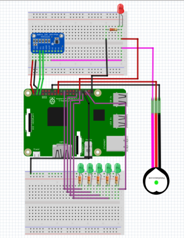

# ky-039_project
This is a project using the KY-039 heartbeat sensor module and a Raspberry Pi.
Initial setup:

Install needed libraries with
```sudo pip3 install adafruit-circuitpython-ads1x15```

Enable I2C on your Raspberry Pi by running 
```sudo raspi-config```
and enabling I2C under "Interfacing Options"

Circuit:

